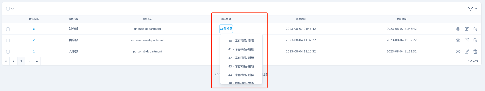
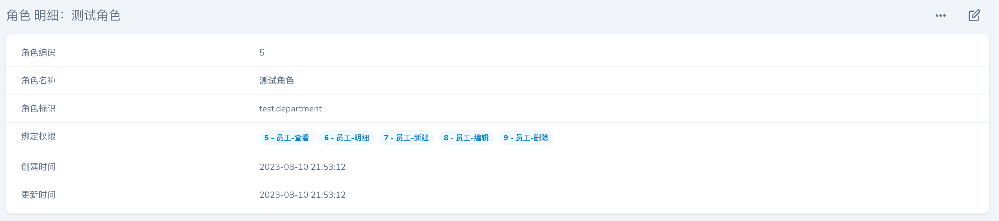

## nova-field-listbox

This package provides a ListBox field for Laravel Nova.

### Screenshots

#### 列表页面


#### 表单页面


#### 详情页面


### Installation

Install the package in a Laravel Nova project via Composer:

```bash
composer require jshxl/list-box
```

### Requirements

- `php: ^7.3|^8.0`
- `laravel/framework: ^10.10`
- `laravel/nova: ^4.0`
- `jshxl/primevue: ^1.0.0`

### More

手册目前懒得写，具体看代码叭

### License

This project is open-sourced software licensed under the [MIT license](LICENSE.md).
